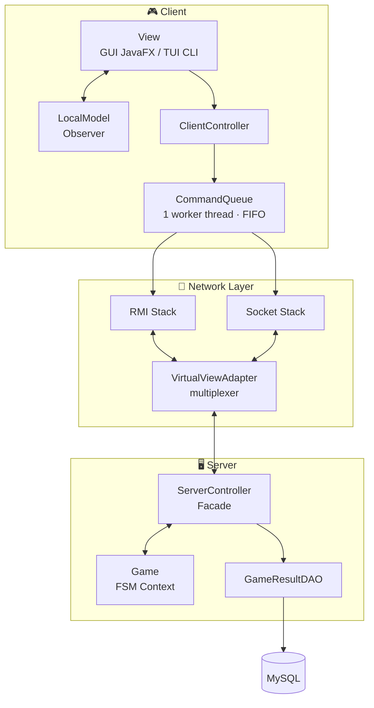
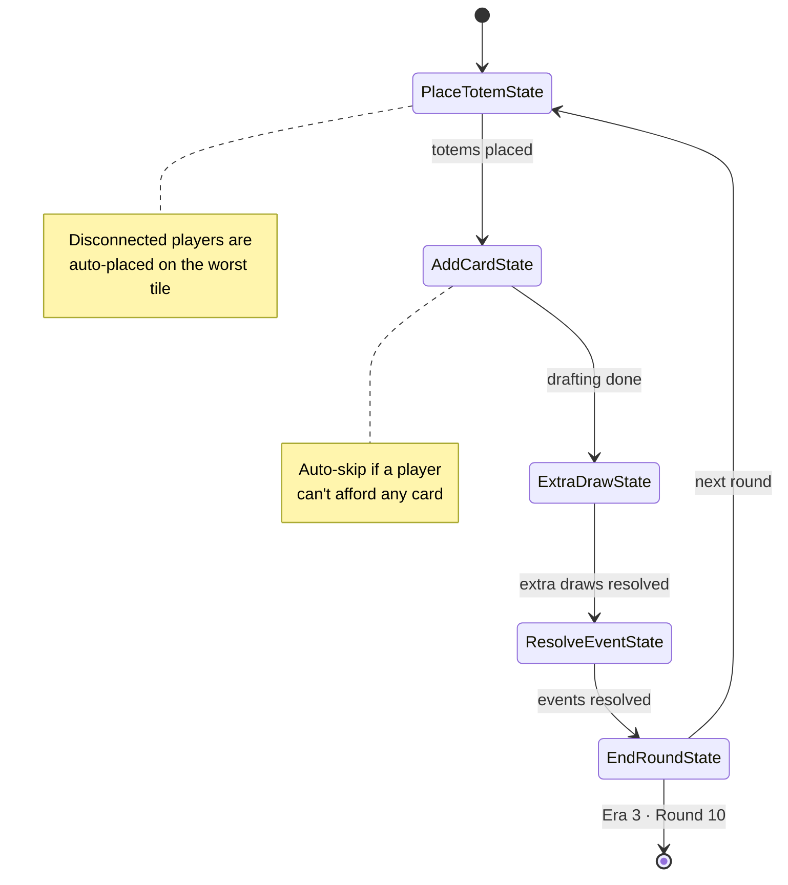
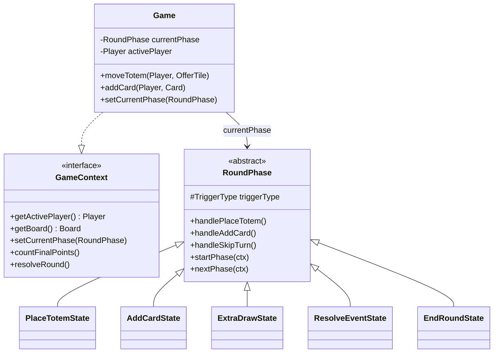
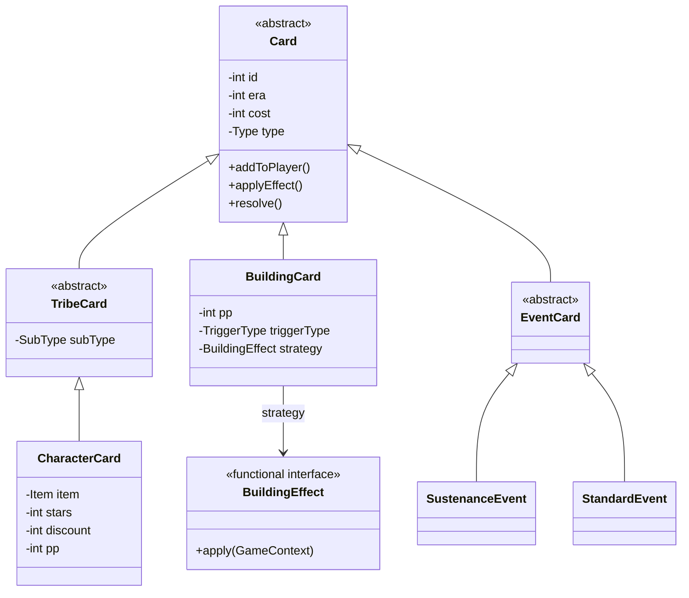
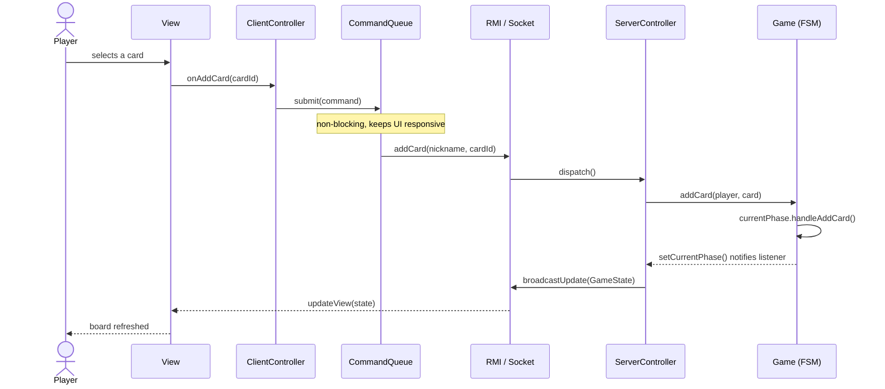
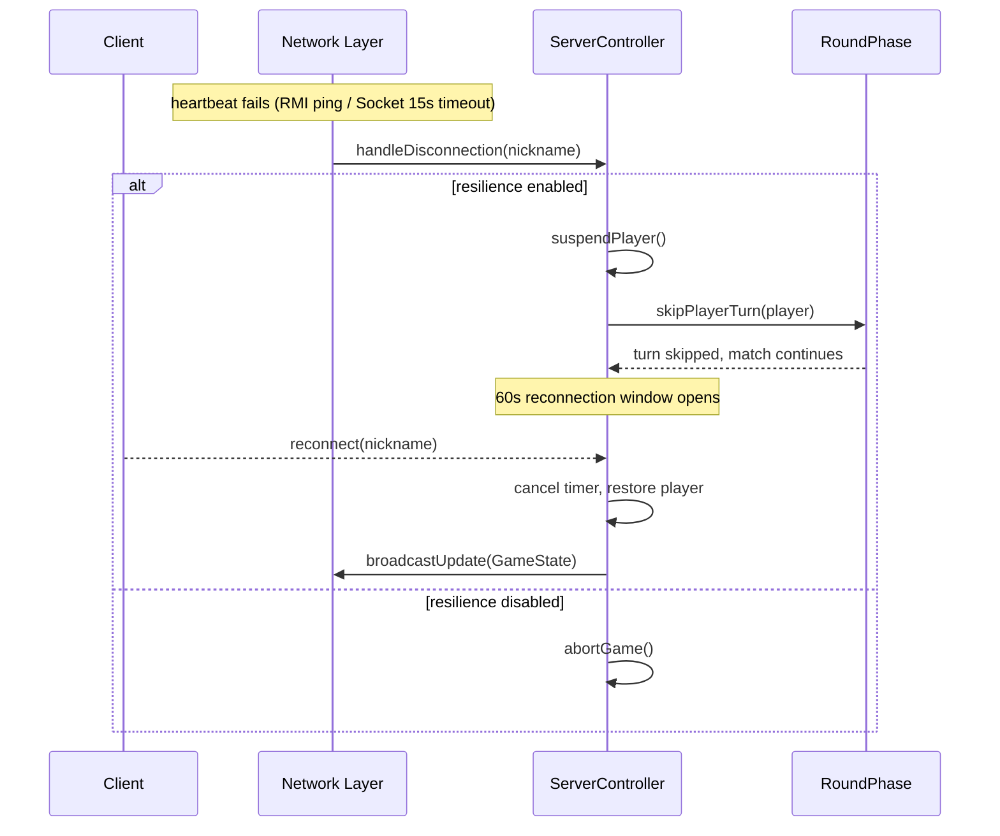

# Mesos - Software Engineering Project ♟️


**Politecnico di Milano - Academic Year 2025/2026**

This repository contains the digital implementation of the board game Mesos, developed as the final project for the Software Engineering course at Politecnico di Milano.

The project features a distributed Client-Server architecture, supporting both RMI and TCP Socket connections, with custom graphical and text-based user interfaces. The project was awarded the maximum grade of **30/30**.

> ⚠️ **Nota sui diritti di proprietà intellettuale / IP Notice**
>
> Il gioco da tavolo Mesos e tutto il relativo materiale grafico è di esclusiva proprietà di **Cranio Creations**.
>
> *(EN: The board game Mesos and all related graphic material are the exclusive property of Cranio Creations.)*


---

## 📋 Table of Contents
1. [Team Members](#-team-members-group-is-am46)
2. [Implemented Features](#-implemented-features)
3. [Architecture Overview](#-architecture-overview)
4. [Design Patterns & Principles](#-design-patterns--principles)
5. [Domain Model](#-domain-model)
6. [Networking & Concurrency](#-networking--concurrency)
7. [Resilience & Persistence](#-resilience--persistence)
8. [Testing](#-testing)
9. [Requirements](#-requirements)
10. [How to Run (with Database Setup)](#-how-to-run)
11. [How to Compile](#-how-to-compile-optional)
12. [Academic Integrity Disclaimer](#-academic-integrity-disclaimer)

---

## 👥 Team Members (Group IS-AM46)

| Name | GitHub |
|---|---|
| Orazio Lorenzo Cioffi | [@oraz090](https://github.com/oraz090) |
| Manuel Cardia | [@ManuelCardiaa](https://github.com/ManuelCardiaa) |
| Riccardo Bresciani | [@RiccardoBresciani](https://github.com/RiccardoBresciani) |
| Luca Cassani | [@Lucucuzzi](https://github.com/Lucucuzzi) |

🏆 **Final grade: 30/30**

---

## ✨ Implemented Features
The application fulfills the requirements specified in the project assignment, specifically:
* **Game Rules:** Implementation of the Complete Rules of Mesos.
* **Architecture:** Distributed MVC (Model-View-Controller).
* **Network Protocols:** Dual implementation using both RMI and TCP Sockets. Players can choose their preferred connection method at runtime.
* **User Interfaces:**
  * **GUI** (Graphical User Interface) developed with JavaFX.
  * **TUI** (Textual User Interface) for command-line usage.
* **Advanced Features:**
  * **Resilience to Disconnections:** The server handles sudden client disconnections gracefully. Disconnected players have their turns skipped automatically. If only one player remains active, a timeout is triggered before declaring a default victory. Players can safely reconnect and resume their match.
  * **Global Leaderboard on DB:** The server maintains a history of match results on an external database. At the end of a match, the client displays the player's position in the global ranking based on the number of players in the match.

---

## 🏗️ Architecture Overview

Mesos follows a **distributed Model-View-Controller (MVC)** architecture split across two independent processes — a stateful server and one or more stateless clients — connected through a protocol-agnostic network layer.

* **Model** — the `Game` domain object and its supporting classes (`Board`, `Player`, the `Card` hierarchy). It contains 100% of the game rules and has zero knowledge of networking or persistence.
* **View** — `CLIView` (text UI) and `GUIView` (JavaFX), both purely presentational and driven by the Observer pattern; a `ViewFactory` picks the right implementation at startup.
* **Controller** — `ServerController` on the server side (validates commands, mutates the model, broadcasts state) and `ClientController` on the client side (local validation, command dispatch).

Every layer can be swapped independently: the CLI and the GUI share the exact same `LocalModel`/`ClientController`, and the RMI/Socket transport is fully interchangeable thanks to a common `VirtualServer`/`VirtualView` abstraction.



**Design rationale:** the domain model (`Game`) never depends on the network or persistence layers — dependencies always point *inward*, toward the domain. This is a direct application of the **Dependency Inversion Principle**, and it's what allows `Game` to be unit-tested with zero network or database setup (see [Testing](#-testing)).

---

## 🎨 Design Patterns & Principles

The codebase leans heavily on GoF design patterns and SOLID principles to stay modular, testable and easy to extend.

| Pattern / Principle | Category | Where it's used |
|---|---|---|
| **State** | GoF Behavioral | `RoundPhase` hierarchy drives the entire round FSM |
| **Strategy** | GoF Behavioral | `BuildingEffect` lambdas encapsulate each building's effect |
| **Observer** | GoF Behavioral | `PhaseChangeListener` (server), `LocalModel` / `ModelObserver` (client) |
| **Template Method** | GoF Behavioral | `RoundPhase` defines the phase lifecycle; subclasses fill in the steps |
| **Command** *(functional variant)* | GoF Behavioral | `BuildingEffect.apply(GameContext)` as a deferred, parameterless action |
| **Composite** | GoF Structural | `Board` aggregates card rows, decks and tiles as one unit |
| **Mediator** | GoF Structural | `Board` coordinates cards/tiles/totems without them knowing each other |
| **Facade** | GoF Structural | `ServerController` exposes a simplified API over `Game` |
| **Factory** | GoF Creational | `BuildingFactory`, `ViewFactory` |
| **DAO** | Enterprise | `GameResultDAO` isolates SQL from game logic |
| **Dependency Inversion** | SOLID | `RoundPhase` depends on `GameContext`, never on `Game` directly |
| **Interface Segregation** | SOLID | `GameContext` exposes only what phases need, hiding setup/lobby methods |

### State Pattern — the Round FSM

Every round is modeled as a **Finite State Machine**: `Game` is the *Context*, `RoundPhase` is the abstract *State*, and each concrete phase (`PlaceTotemState`, `AddCardState`, `ExtraDrawState`, `ResolveEventState`, `EndRoundState`) knows exactly which phase comes next, forming a self-contained chain of states.





Each concrete state decides its own successor, e.g.:

```java
// EndRoundState.java
@Override
public void nextPhase(GameContext ctx) {
    RoundPhase next = new PlaceTotemState();
    ctx.setCurrentPhase(next);
    next.startPhase(ctx);
}
```

This keeps every phase's responsibility small (Single Responsibility) and turns what would otherwise be a giant `switch` on "current phase" into clean polymorphism.

### Strategy Pattern — Building Effects

Instead of a subclass per building (21 unique effects), every `BuildingCard` holds a `BuildingEffect` — a `@FunctionalInterface` — assigned declaratively in `BuildingFactory`:

```java
// BuildingFactory.java
BuildingCard card = new BuildingCard(id, era, cost, pp, TriggerType.ADDCARD,
    ctx -> ctx.getActivePlayer().modifyFood(2));
```

`BuildingCard.applyEffect()` simply delegates to `strategy.apply(ctx)`, without ever knowing what the effect actually does — new effects only require a new lambda, never a new class.

### Observer Pattern — Decoupled Notifications

* **Server side:** `Game` holds a `PhaseChangeListener`. Every `setCurrentPhase()` call notifies `ServerController`, which reacts by broadcasting state, persisting results, or declaring a winner — `Game` never calls `ServerController` directly.
* **Client side:** `LocalModel` notifies every registered `ModelObserver` (the active `GameView`) whenever a new `GameState` arrives from the network.

### SOLID in Practice

* **Dependency Inversion Principle (DIP):** `RoundPhase` (high-level policy) depends only on the `GameContext` abstraction, never on the concrete `Game` class — phases can be unit-tested with a mocked context.
* **Interface Segregation Principle (ISP):** `GameContext` exposes only the operations phases legitimately need (`getActivePlayer`, `setCurrentPhase`, `resolveRound`, …); lobby/setup-only methods (`addPlayer`, `assignColor`) stay on `Game` and out of the FSM's reach.

---

## 🧩 Domain Model

| Class | Role |
|---|---|
| `Game` | FSM **Context** — holds match state, exposes high-level operations (`moveTotem`, `addCard`) |
| `GameContext` | Interface abstracting `Game` for the FSM states (enables DIP) |
| `RoundPhase` | Abstract **State** — one concrete subclass per phase of a round |
| `Board` | **Composite** / **Mediator** aggregating rows, decks and tiles; every getter returns a defensive copy |
| `Player` | Domain entity — resources, built cards, connectivity flag, scoring calculations |
| `Card` family | Polymorphic hierarchy for tribe, building and event cards |
| `BuildingEffect` | Functional interface — the **Strategy** for building effects |



`Card` exposes `addToPlayer()`, `applyEffect()` and `resolve()` as no-op hooks rather than abstract methods, so the `Board` can hold and iterate over a single, uniform `ArrayList<Card>` and let each subtype respond polymorphically — no `instanceof`, no casting.

---

## 🌐 Networking & Concurrency
Mesos supports two fully interchangeable network protocols — clients choose one at connection time, and both can coexist in the same match thanks to the `VirtualViewAdapter` multiplexer.

### RMI vs Socket

| Aspect | RMI | Socket (TCP) |
|---|---|---|
| Communication model | Transparent remote method calls (synchronous) | Raw byte stream, JSON-encoded messages |
| Serialization | Native Java serialization | JSON (human-readable, cross-platform) |
| Type safety | Compile-time | Runtime (manual parsing) |
| Server → Client callbacks | Native, via remote stubs | Manual, via a dedicated listener thread |
| Disconnection detection | Automatic (`RemoteException` on a failed `ping()`) | Manual heartbeat — 5s ping / 15s timeout |
| Firewall / NAT friendliness | Poor (dynamic ports) | Good (fixed port) |
| Cross-platform clients | No (Java-only) | Yes |

### Taming synchronous RMI — `AsyncBroadcastManager`
RMI calls are naturally synchronous, so a lagging client could otherwise freeze the whole server. `AsyncBroadcastManager` gives **each client its own bounded queue (capacity 2) and its own worker thread**: if a client lags, only its dedicated thread blocks — the server and every other client stay fully responsive. The capacity-2 cap is intentional: during automatic phase transitions the server can emit several `GameState` snapshots within milliseconds, and a lagging client only ever needs the *latest* one.

### Keeping the client responsive — `CommandQueue`
On the client side, every outgoing command (RMI or Socket alike) is pushed onto a single-worker `CommandQueue` instead of being sent synchronously from the UI thread. This guarantees:
* **Non-blocking UI** — the JavaFX Application Thread / CLI input thread is never stalled by network latency.
* **Strict FIFO ordering** — a single worker thread means commands reach the server in the exact order the player triggered them.



---

## 🛡️ Resilience & Persistence

### Disconnection Resilience
The server can run in two modes:
* **Abort mode** — any disconnection ends the match immediately.
* **Suspend mode** *(default)* — a disconnected player is marked offline, their turn is auto-skipped by the current `RoundPhase`, and they have **60 seconds** to reconnect and resume exactly where they left off. If only one player remains online, the same 60-second countdown decides the match by default victory unless someone reconnects first.

Each `RoundPhase` implements its own `handleSkipTurn()`, so the "right" thing to do on disconnect depends on the phase — e.g. `PlaceTotemState` auto-places the totem on the worst available tile, while `AddCardState` skips the draft turn *without* auto-picking a card, to avoid making choices on the player's behalf.



### Global Leaderboard
At the end of a match, results are persisted through a `GameResultDAO` (**DAO pattern**, see [How to Run](#-how-to-run) for the schema), keeping raw SQL isolated from game logic. The leaderboard query is scoped **by number of players**, so a 2-player win is only ever compared against other 2-player matches.

---

## 🧪 Testing
The core domain logic of the game was developed with a strong focus on reliability and correctness, following a bottom-up approach (Unit, Integration, and E2E Testing).
* **Test Suite:** A total of **93 tests** have been written using JUnit 5.
* **Coverage:** The core Domain `Model` achieves a **92% line coverage**, ensuring that game rules, points calculations, and state transitions are thoroughly verified.

| Level | Focus | Example classes |
|---|---|---|
| **Unit** | Isolated domain classes | `DeckTest`, `PlayerTest`, `TurnTileTest` |
| **Integration** | Components working together | `BoardUnitTest`, `BoardRulesTest`, `GameTest`, `ServerControllerTest` |
| **End-to-End** | Full match simulation | `GameSimulationTest` (10 rounds, 2 players), `TestThreePlayers` (3 rounds, 3 players) |

**Techniques used:**
* **Test doubles** — `ServerControllerTest` uses a `FakeVirtualView` / `FakeNetworkMode` pair to test the controller without spinning up real RMI/Socket servers.
* **Deterministic simulation** — `GameSimulationTest` injects a fixed deck via Java Reflection, making full-game simulations reproducible without adding test-only setters to production code.
* **Arrange-Act-Assert** — consistently applied across the suite for readability and maintainability.

---

## ⚙️ Requirements
To compile and run the application, the following software is required:
* **Java:** JDK 21 (Java 17 is the minimum supported version).
* **Maven:** Used for dependency management and building the project.
* **Database:** A running instance of an SQL database (for the Leaderboard feature).

---

## 🚀 How to Run

### 0. Database Setup (Crucial)
Before starting the server, you must configure the MySQL/PostgreSQL database to enable the Leaderboard functionality.

**Step A: Create the Tables**

Run the following SQL script on your database instance to generate the required tables:

```sql
CREATE TABLE MATCHES (
    id INT AUTO_INCREMENT PRIMARY KEY,
    num_players INT NOT NULL,
    match_date TIMESTAMP DEFAULT CURRENT_TIMESTAMP
);

CREATE TABLE MATCH_RESULTS (
    id INT AUTO_INCREMENT PRIMARY KEY,
    match_id INT NOT NULL,
    nickname VARCHAR(50) NOT NULL,
    score INT NOT NULL,
    final_position INT NOT NULL,
    FOREIGN KEY (match_id) REFERENCES MATCHES(id)
);
```

**Step B: Configure the Server**

1. Locate the `db.properties.example` file in the project directory.
2. Copy and rename it to `db.properties`.
3. Fill in your local/remote database URL, username, and password.

### 1. Starting the Server
The Server must be started before any client can connect. Navigate to the `deliveries` folder, open a terminal and run:

```bash
java -jar am46-1.0-SNAPSHOT-Server.jar
```

The server will initialize the database connection and begin listening for incoming clients.

### 2. Starting a Client
Open a new terminal window in the same folder and run:

```bash
java -jar am46-1.0-SNAPSHOT-Client.jar
```

Upon launching, the Client application will prompt you to choose:
* The User Interface (GUI or TUI).
* The Network Protocol (RMI or Socket).
* The Server IP Address (use `localhost` or `127.0.0.1` if running locally).

> **Tip:** You can open multiple instances of the Client in separate terminals to simulate a multiplayer match on the same machine.

---

## 🛠 How to Compile (Optional)
If you wish to recompile the project from the source code instead of using the provided executables, navigate to the root directory of the project and run the following Maven command:

```bash
mvn clean package
```

This will generate the "Fat JARs" for the Server and the Client inside the `target` directory.

---

## ⚠️ Academic Integrity Disclaimer
This repository contains the result of a university assignment. It is made public for portfolio purposes only. Current or future students of the Politecnico di Milano are strictly prohibited from copying, reproducing, or using this code for their own assignments, as it constitutes a violation of the university's code of ethics and plagiarism policies.

This repository contains only the **software implementation** (source code) of the game. The board game Mesos, its rules, and all related graphic material remain the exclusive property of **Cranio Creations**; no ownership over the original game or its assets is claimed or implied.
